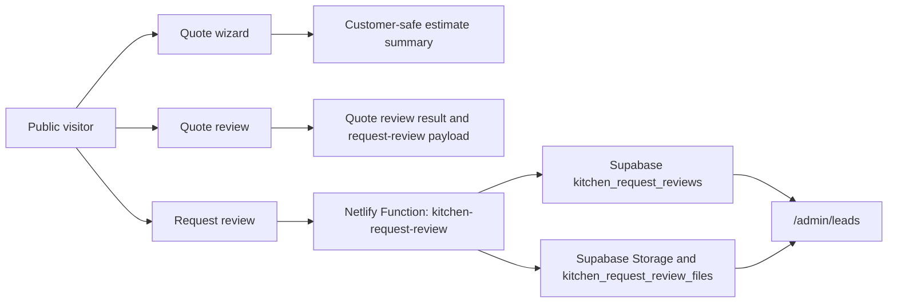

# Advanced Kitchen Design-Build Tool Product Architecture

Last updated: 23 June 2026

Deployment status: not needed.

## Existing Architecture Found

### Framework And Build

- Next.js `^14.2.35`
- React `18.2.0`
- TypeScript
- Tailwind/PostCSS plus global CSS
- `next.config.js` uses `output: 'export'`
- Netlify should publish `out`
- Runtime backend work uses Netlify Functions in `netlify/functions`

### Package Scripts

- `npm run dev`: `next dev -p 3000`
- `npm run build`: `next build && node scripts/verify-build-content.js`
- `npm run lint`: `next lint`
- `npm test -- --runInBand`: Jest local test gate
- `npm run test:ci`: `jest --runInBand`

### Routing Model

The app uses the Pages Router under `src/pages`.

Core public routes include:

- `/`
- `/quote`
- `/quote/[id]`
- `/quote/review`
- `/request-review`
- `/site-measure`
- `/quote-review-service`
- `/how-it-works`
- `/design`
- `/advice`
- `/faqs`
- `/privacy`
- `/terms`
- `/areas`
- `/areas/[slug]`
- service and education pages such as `/kitchen-renovation-cost-sydney`, `/kitchen-quote-review`, `/kitchen-renovation-process`, `/kitchen-pc-sums-and-provisional-sums`

Internal/admin routes include:

- `/admin/leads`
- `/admin/*` legacy/local CMS routes
- `/account`
- `/auth/signin`

Production static export means Next API routes under `src/pages/api` are not the production runtime path for public static deployment. Netlify Functions are the safe production runtime layer.

### Public Layout And Chatbot

`src/components/PublicLayout.tsx` provides:

- header brand/navigation
- footer link groups
- mobile sticky CTA
- canonical URL and favicon

`src/components/KitchenChatbot.tsx` provides:

- assistant launcher
- safe guidance copy
- quick prompts
- links to estimate, quote review, request review and site measure

### Quote Flow

`/quote` renders `src/components/QuoteWizard.tsx`.

The wizard currently uses nine steps:

1. Project
2. Property
3. Layout
4. Inclusions
5. Finishes
6. Services
7. Quote details
8. Contact
9. Estimate

`src/lib/pricing.ts` calculates raw pricing outputs, including internal line-item/cost fields. `src/lib/quotePresentation.ts` projects the raw result into a customer-safe `CustomerQuoteSummary` before customer-facing display.

### Quote Review Flow

`/quote/review` uses `src/lib/quoteReview.ts` for deterministic review scoring:

- scope clarity
- allowance risk
- missing information
- review readiness
- missing items
- unclear items
- customer questions
- compliance prompts
- recommended next step

It can submit a customer-safe request-review payload to `/.netlify/functions/kitchen-request-review`.

### Request Review Flow

`/request-review` collects contact/project details, privacy/terms acknowledgement, optional marketing opt-in, simple attribution and optional file data.

`src/lib/requestReview.ts` validates and sanitises the payload, rejects unsupported internal fields, validates files and constructs a customer-safe lead object.

`netlify/functions/kitchen-request-review.ts` stores leads, stores files when configured and optionally prepares Resend email notification.

### Site Measure Flow

`/site-measure` explains why site-specific review matters and routes users to request review, estimate or quote review. It uses safe wording around site measure and written scope confirmation.

### Admin Handoff

`/admin/leads` is token-gated through Netlify Functions and reads from Supabase via server-side service role only.

Functions:

- `kitchen-admin-leads`
- `kitchen-admin-lead-update`
- `kitchen-admin-file-download`
- `kitchen-admin-file-delete`

Admin-safe fields include status, internal notes and file metadata. Service role keys, supplier costs, pricing internals and hidden score logic are not exposed.

### Supabase Structure And Service Layer

Current docs define:

- `public.kitchen_request_reviews`
- `public.kitchen_request_review_files`

Primary server-side adapters:

- `src/lib/kitchenLeadStorage.ts`
- `src/lib/kitchenFileStorage.ts`
- `src/lib/kitchenAdminLeads.ts`
- `src/lib/kitchenAdminFiles.ts`

Supabase is source of truth for leads. Email is notification only.

### Analytics And Attribution

`src/lib/analytics.ts` defines local event names and dispatches browser custom events. No production analytics vendor is connected by this abstraction.

Request-review attribution captures:

- source route
- referrer
- UTM source/medium/campaign/content/term
- landing page

No cookie-based tracking is required for the current attribution flow.

### Tests And Guardrails

The repo uses Jest and React Testing Library.

Existing guardrail coverage includes:

- public copy forbidden terms
- quote/pricing logic
- quote review
- request-review validation/page
- admin leads/file operations
- visual system
- controlled-testing docs
- SEO docs
- brand assets

## Existing Customer Data Flow

## Service Boundaries

- Browser: collect customer-safe inputs, show planning guidance, never receive service keys or internal pricing objects.
- Netlify Functions: validate, store, notify, admin auth, signed URLs and safe mutation endpoints.
- Supabase: durable source of truth for request-review leads/files.
- Docs/tests: preserve stage gates and public copy guardrails.

## Proposed Architecture For Advanced Tool

### Phase 1 Route

Preferred route: `/design-brief`.

Do not add to public header, footer, chatbot or sitemap while incomplete or disabled.

### Phase 1 Service Shape

Add pure deterministic logic before persistence:

- `calculateMissingDesignBriefInformation`
- `createDesignBriefSummary`
- `recommendDesignBriefPathway`
- `getDesignBriefReadinessState`

Keep these functions independent from React and Netlify Functions.

### Phase 1 Persistence Strategy

Initial default: no production persistence until approved.

Recommended approach:

1. create TypeScript contracts and pure logic
2. provide local component state for draft input
3. avoid sensitive localStorage by default
4. if persistence is required, introduce a typed adapter interface
5. propose additive Supabase SQL only after the Phase 1 data contract is reviewed

### Phase 1 Admin Handoff

Do not invent a new admin console immediately. First produce an admin-readable payload that can later attach to existing `kitchen_request_reviews` records or a future kitchen-namespaced design brief table.

## Database Relationships

Existing:

- `kitchen_request_reviews.id`
- `kitchen_request_review_files.lead_id`

Future options to review before implementation:

- attach `design_brief_json` to `kitchen_request_reviews`
- create `kitchen_design_briefs` with an optional relationship to a request-review lead
- create a server-backed draft table only if safe visitor identity/session rules are defined

Do not create direct foreign-key relationships until anonymous visitor identity and lead creation timing are clear.

## State Management Strategy

Existing flows use React component state and deterministic TypeScript helpers.

Phase 1 should continue this pattern:

- local component state for current wizard session
- pure functions for summary, missing-info, readiness and routing
- no sensitive data in public URLs
- no browser-side service-role calls
- browser storage only after a documented privacy trade-off

## Validation Strategy

- Validate required fields in UI.
- Validate payloads again in pure functions or server adapters if submitted.
- Sanitise free text lengths.
- Reject or ignore internal/admin fields.
- Keep unsafe upload claims out of Phase 1 unless upload is explicitly part of the approved route.

## Reporting Strategy

Phase 1 output is a customer-facing design brief summary and missing-information checklist, not a report PDF.

Future Phase 6 reports must be human-reviewed before customer delivery.

## AI Boundaries

Phase 1 should not call a third-party AI API.

Interfaces may allow future AI-assisted summarisation, but first implementation should be deterministic, testable and explainable.

## Future Operon System Reuse

Reusable patterns:

- staged intake contracts
- deterministic missing-information engines
- pathway routing
- admin-readable payloads
- token-gated admin operations
- customer-safe projection boundaries
- static public content plus serverless runtime functions

Branch-specific content, pricing assumptions and compliance prompts must remain namespaced.

## Unresolved Questions

- Should `/design-brief` be a standalone route or folded into the existing `/design` route after review?
- Should Phase 1 submit to existing request-review storage or remain local until controlled users validate the flow?
- Should a feature flag be environment-driven, build-time only or source constant for local review?
- What minimum fields should trigger admin handoff versus simply routing to `/quote`?
- How much draft data, if any, is acceptable in browser storage?
